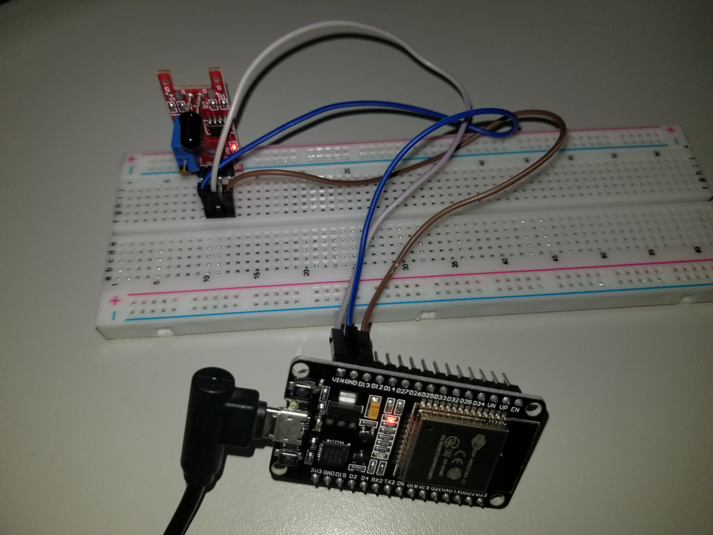

# ESP32 - Flame Sensor

This tutorial instructs you how to use ESP32 to read the information from Ky-026 Flame sensor, turn on the led and print to Serial Monitor if it's fire or not.

## Hardware Used In This Tutorial

  * 1	×	ESP32 Dev Module	
  * 1	×	Micro USB Cable	
  * 1	×	Flame Sensor Ky-026	
  * 1	×	Protoboard	
  * n	×	Jumper Wires

---

## Introduction to Flame Sensor - Ky-026

  * LED1: Shows that the sensor is supplied with voltage
  * LED2: Shows that the sensor detects a flame


### Flame Sensor Ky-026 Pinout

Has four pins:


## Wiring Diagram Flame Sensor Ky-026 and ESP32


## ESP32 Code

```c++
//Arduino Flame Sensor
#define FLAME_PIN 13
//#define LED_PIN 2

int Flame = HIGH;

void setup() 
{
  //pinMode(LED_PIN, OUTPUT);
  pinMode(FLAME_PIN, INPUT);
  Serial.begin(9600);
}

void loop() 
{
  Flame = digitalRead(FLAME_PIN);
  if (Flame == HIGH)
  {
    //digitalWrite(LED_PIN, HIGH);
    Serial.print("Si hay fuego pa\n");
    
  }
  else
  {
    //digitalWrite(LED_PIN, LOW);
    Serial.print("Todo bien pa\n");
  }
    delay(500);
}
```


