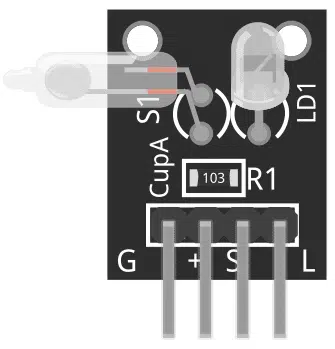
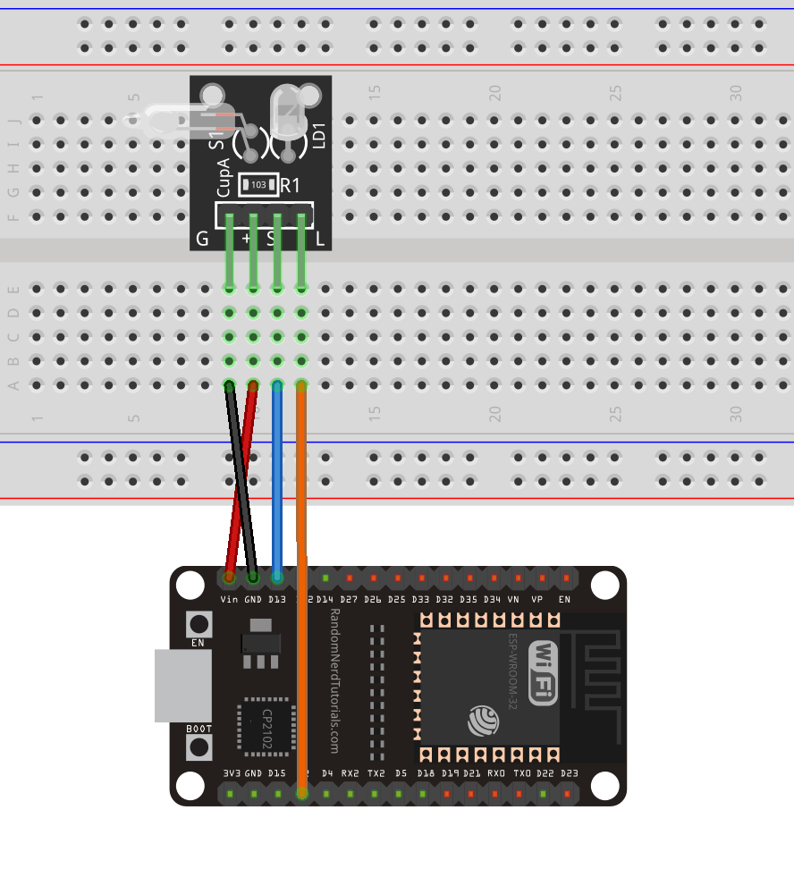

# ESP32 - Light Cup Sensor

This tutorial instructs you how to use ESP32 to read the information from KY-027 Light Cup sensor, turn on the led and print to Serial Monitor if it's on nivel (well positioned) or not.

## Hardware Used In This Tutorial

  * 1	×	ESP32 Dev Module	
  * 1	×	Micro USB Cable	
  * 1	×	Light Cup KY-027 sensor
  * 1	×	Protoboard	
  * n	×	Jumper Wires

---

## Introduction to Light Cup KY-027 sensor.

This module has a mercury switch and an LED mounted on a breakout board, a mercury switch is a type of switch wherein the contacts are closed by a blob of mercury. If the switch is tilted, the mercury will flow and will open the contacts.

The KY-027 module has four pins.

G =	GND
(+) =	+5V
S =	From Mercury Switch
L	= From LED Anode (+)




## Wiring Diagram Light Cup KY-027 Sensor and ESP32

Red wire:     Vin - (+)

Black wire:   GND - G

Blue wire:    D13 - S

Orange wire:  D2 - L




## ESP32 Code

```c++
//KY-027 module

#define SWITCH_PIN 13
#define LED_PIN 2
int State = HIGH;

void setup() 
{
  pinMode(SWITCH_PIN, INPUT);
  pinMode(LED_PIN, OUTPUT);
  Serial.begin(9600);
}

void loop() 
{
  State = digitalRead(SWITCH_PIN);
  if (State == HIGH)
  {
        digitalWrite(LED_PIN, HIGH);
        Serial.print("Acomodalo\n");
  }
  else
  {
    digitalWrite(LED_PIN, LOW);
    Serial.print("Ya está nivelado\n");
  }
  delay(1000);
}
```


